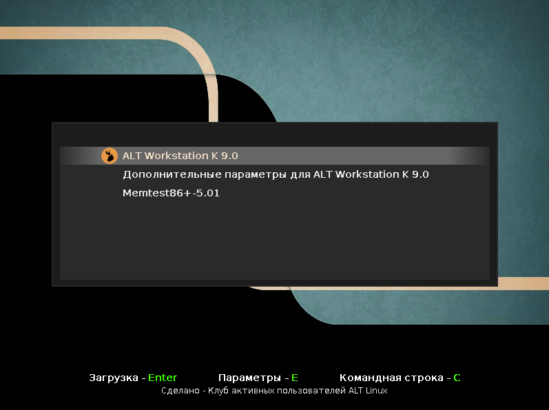

# AltClub GRUB Theme

**Source Code:**

## Summary:
The GRUB2 bootloader theme supports all used Linux distributions.

## Description:
Recommended screen size from 800x600
The position of the blocks is in percentage and allows you to flexibly resize the screen
For fine-tuning you can use either the manual method or the "grub-customizer" program.

## License: 
GPLv3

## Discussions
[Forum altlinux](https://forum.altlinux.org/index.php?topic=43354.0)

## Install
Download the archive and repack it to .tar.gz.
Install using the "grub-customizer" program.

## Editing a theme
You can always change the text in the theme.txt file in the root directory.

## Changelog
* New version v1.3

## Preview

  

